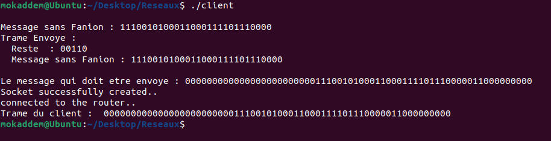
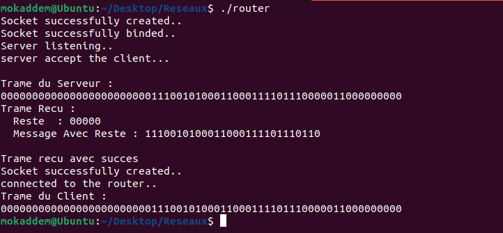
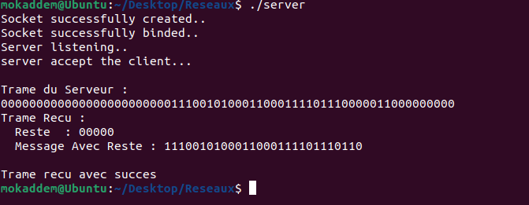

# Projet : Architecture Réseau à 4 Couches

## Objectif
Ce projet vise à créer une architecture réseau à quatre couches, avec pour objectif principal la mise en place d'une communication client-serveur efficace en utilisant des sockets sous l'environnement Linux. Pour atteindre cet objectif, nous développons trois programmes clés : `client`, `router`, et `server`. Ces programmes permettent d'établir une communication fluide au sein d'un réseau en utilisant une technique de vérification de redondance cyclique (CRC) pour garantir l'intégrité des données. Vous trouverez ci-dessous des instructions détaillées pour compiler et exécuter ces programmes, ainsi qu'une description complète de leurs fonctionnalités.

## Fonctionnalités principales

1. **Programmes Client et Serveur**
   - Développer deux programmes, `Client.c` et `Serveur.c`, pour établir une communication client-serveur sur une machine Linux.

2. **Tramage de la Communication**
   - Mettre en place un tramage pour la communication avec une trame de 10 octets.
   - Les champs de la trame comprennent :
     - Un délimiteur de trame (un octet de 8 zéros).
     - Adresse source (un chiffre binaire sur un octet).
     - Adresse destination (un chiffre binaire sur un octet).
     - Données sur 2 octets.
     - CRC (calculé sur un octet en utilisant un polynôme générateur : G(X) = X^3 + X^2 + 1).

3. **Calcul des CRC**
   - Écrire deux fonctions pour calculer les CRC, une pour l'émission et une pour la réception.

4. **Gestion des Erreurs**
   - Implémenter une fonction `analyser_controle_Erreur()` qui appelle la fonction appropriée pour la gestion des erreurs, que ce soit en émission ou en réception.

5. **Fichier Routeur.c**
   - Créer un fichier `Routeur.c` comportant les fonctions d'un routeur.
   - Réaliser une communication client-routeur (RI)-serveur.
   - Créer un autre routeur R5 et réaliser la communication client-routeur (R1)-routeur (R5)-serveur.
   - Ajouter 3 autres routeurs (R3, R4, R5) avec des liens entre eux.

6. **Traitement du Routage**
   - Écrire une fonction `traitement_Routage()` qui réalise le routage et l'encapsulation au niveau de la couche 3.
   - L'adressage au niveau de la couche 2 doit être équivalent à celui de la couche 3 en créant un paquet de 12 octets (Adresse Source - Adresse Destination - Données (Trame)).

7. **Couche 4 - Segmentation et Encapsulation**
   - Mettre en place une couche 4 similaire à TCP/IP qui effectue la segmentation et l'encapsulation.

## Rôle et Explications des Fichiers

Ce projet repose sur une architecture réseau en quatre couches et met en œuvre divers fichiers, chacun ayant un rôle spécifique et accompagné de commentaires détaillés pour expliquer chaque fonction et traitement. Voici une vue d'ensemble des fichiers clés :

- **client.c :** Contient le programme client qui établit une connexion avec le serveur, envoie des trames de données avec vérification CRC, et communique avec le routeur. Les commentaires internes guident à travers chaque étape du processus.

- **router.c :** Le programme du routeur assure la gestion de la communication entre le client et le serveur en relayant les trames. Il est capable de communiquer avec plusieurs routeurs, et son code est abondamment commenté pour expliquer son fonctionnement.

- **server.c :** Le serveur écoute les connexions entrantes des clients (les routeurs), reçoit les trames de données avec vérification CRC, et assure la communication avec les clients. Chaque fonction et traitement est accompagné de commentaires explicatifs.

- **utilities.h :** Contient des fonctions pour fragmenter les données à envoyer en sous-chaînes de taille fixe. Chaque fonction est documentée pour une compréhension aisée.

- **crc.h et crc.c :** Ces fichiers définissent et implémentent les fonctions de calcul et de validation du code de redondance cyclique (CRC), utilisé pour garantir l'intégrité des données transmises. Chaque fonction est expliquée en détail dans les commentaires.

L'inclusion de commentaires détaillés dans chaque fichier facilite la compréhension du fonctionnement du projet. Pour plus d'informations sur chaque fichier ou son utilisation, consultez le code source et les commentaires correspondants.

## Comment compiler les fichiers?

### crc.c
```
gcc -c crc.c
```
### client.c
```
gcc -c client.c
gcc client.o crc.o -o client
```
### router.c
```
gcc -c router.c
gcc router.o crc.o -o router
```
### server.c
```
gcc -c server.c
gcc server.o crc.o -o server
```
## Exécution du projet
Pour exécuter le projet, suivez ces étapes dans trois terminaux distincts sous Linux :
```
./server
./router
./client
```
## Screenshots

### Client



### Router



### Server


## Conclusion et Perspectives

Ce projet a été une expérience enrichissante où j'ai pu concevoir une architecture réseau en quatre couches, mettant en œuvre une communication client-serveur robuste grâce à la vérification de redondance cyclique (CRC). J'ai pris soin de commenter chaque fichier pour en faciliter la compréhension et l'utilisation.

### Perspectives Futures

1. **Extension du Réseau de Routeurs :** Dans l'avenir, je prévois d'étendre le réseau en ajoutant d'autres routeurs entre le client et le serveur. Chaque routeur sera capable de communiquer avec celui qui lui envoie les données, créant ainsi un réseau de relais efficace. Cette expansion améliorera considérablement la scalabilité et la fiabilité de notre communication.

2. **Application Annuaire (Serveur DNS) :** Une perspective qui m'enthousiasme est le développement d'une application appelée "annuaire()" qui agit comme un serveur DNS. Cette application permettra d'associer des noms de terminaux à des adresses IP, simplifiant ainsi la résolution des noms de domaine au sein de notre réseau.

3. **Page Web de Connexion :** J'envisage également la création d'une page web sous forme d'un formulaire qui facilitera la demande de connexion au réseau. Cette page offrira une interface conviviale aux utilisateurs, simplifiant leur interaction avec notre architecture réseau.

L'avenir de ce projet est prometteur, et je suis déterminé à continuer son développement pour apporter des améliorations significatives. Mon objectif est de renforcer la capacité du réseau, de simplifier la gestion des terminaux et d'améliorer l'expérience utilisateur. Je suis enthousiaste à l'idée de poursuivre ce travail et de le voir évoluer.


## Collaboration et Contribution

Je vous encourage vivement à collaborer et à contribuer à ce projet. Si vous souhaitez vous impliquer, voici comment vous pouvez participer :

- **Améliorations et Corrections :** Si vous avez des idées d'améliorations, de fonctionnalités supplémentaires ou si vous avez repéré des erreurs, n'hésitez pas à ouvrir des issues sur le dépôt GitHub. Je suis ouvert aux discussions et aux suggestions de la communauté.

- **Contributions de Code :** Si vous êtes intéressé par le développement de code, je vous invite à proposer des pull requests. Vos contributions seront examinées attentivement et peuvent être intégrées au projet.

- **Rapports de Problèmes :** Si vous rencontrez des problèmes lors de l'utilisation de ce projet, veuillez les signaler en ouvrant des rapports de problèmes sur GitHub. Cela m'aidera à identifier et à résoudre rapidement les problèmes.

- **Documentation :** Une documentation claire et précise est essentielle. Si vous pouvez contribuer à améliorer la documentation en fournissant des exemples d'utilisation, des guides d'installation ou toute autre information utile, cela serait grandement apprécié.

- **Test et Retours d'Expérience :** Si vous avez testé ce projet dans différents environnements ou configurations, partagez vos retours d'expérience. Cela peut être précieux pour d'autres utilisateurs.

Pour collaborer avec moi, rendez-vous sur le dépôt GitHub [[lien vers le dépôt](https://github.com/mokaddemhicham/Communication-Client-Router-Server-via-les-Sockets)] et explorez les options de contribution. Votre engagement et vos contributions sont essentiels pour faire de ce projet une ressource de qualité pour la communauté. Je vous remercie pour votre intérêt et votre soutien continu.
